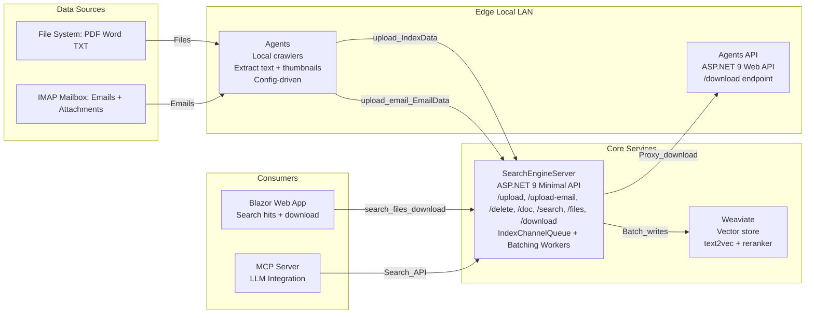

# Search Engine  

> **TL;DR**  
> *Agents* = local crawlers that extract text + thumbnails from files & e-mails and send the results to a server.  
> *Agents API* = ASP .NET 9 Web API that allows monitored files to be downloaded, exposes a `/download` endpoint.  
> *Server* = thin ASP .NET 9 Web API that buffers/batches the incoming indices and persists them into **Weaviate**, then exposes a `/search` endpoint.  
> *Client* = Blazor web app that allows for easy search using the server API. Displays a neat list of search hits and allows for download of those files.  
> *MCP Server* = thin MCP server which allows for LLMs to also use search.

---

## 1 • What problems does this solve?  

1. **Desktop/LAN content discovery** – index PDFs, Word docs, plain-text files and IMAP mailboxes you own.  
2. **Central search API** – a small server you can run on your laptop, NAS, Raspberry Pi or cloud VM.  
3. **Semantic search** – delegated to Weaviate’s vector engine with optional cross-encoder re-ranking.  

---

## 2 • Agents (SearchEngineAgents)
Currently there are agents that support these data sources:
- PDF 
- Word
- Plain text
- E-mail

### Configuration (SearchEngineAgents/appsettings.json and SearchEngineAgentsAPI/appsettings.json)
Please keep `IncludedPaths` and `ScanExclusions` the same in both configs for proper functioning.

```jsonc
{
  "EmailSettings": {
    "Enabled":   true,
    "ImapHost":  "imap.example.com",
    "ImapPort":  993,
    "UseSsl":    true,
    "Username":  "me@example.com",
    "Password":  "••••••"
  },
  "AgentDelaysSeconds": {
    "Files":  20,
    "Email": 300
  },
  "ServerAddress": "http://localhost:5000", // your SearchEngineServer endpoint
  "IncludedPaths": {
    "Paths": [ "C:\\Docs", "D:\\KnowledgeBase" ]
  },
  "ScanExclusions": {
    "Paths": [ "C:\\Docs\\Private\\", "C:\\Windows" ],
    "FolderNames": [ "node_modules", ".git" ]
  },
  "AttachmentSettings": {
    "Enabled": true,
    "RootPath": "C:\\Path\\To\\Save\\Attachments\\To",
    "SaveInline": false,
    "MinInlineBytes": 4096,
    "MaxAttachmentMB": 25,
    "AllowedExtensions": [ ".pdf", ".docx", ".doc", ".txt", ".rtf", ".pptx", ".xlsx", ".csv", ".png", ".jpg", ".jpeg" ],
    "BlockExecutables": true
  },
  "EmailArchive": {
    "Enabled": true,
    "RootPath": "C:\\Path\\To\\Save\\Emails\\To"
  }
}
```

The specified `RootPath` in `AttachmentSettings` is also always included in the scan.

## 3 • Server (SearchEngineServer)

* Minimal-API project (`dotnet run`)  
* Accepts `/upload` & `/delete` 
* Buffers incoming indices in an in-memory **Channel** (`IndexChannelQueue`)  
* Background services (`IndexBatchingWorker` and `EmailBatchingWorker`) flush batches (default 64) every *n* seconds (default 3 s)  
* Storage backend = **Weaviate** (self-hosted Docker or Weaviate Cloud)

### Endpoints

| Verb  | Route                               | Purpose                                                         |
|-------|-------------------------------------|-----------------------------------------------------------------|
| `POST`| `/upload`                           | Accept a single `IndexData` record; returns **202 Accepted**    |
| `POST`| `/upload-email`                     | Accept a single `EmailData` record; returns **202 Accepted**    |
| `POST`| `/delete?uid=GUID`                  | Delete one record by uid                                        |
| `HEAD`| `/doc/{uid}`                        | Existence probe used by agents to skip re-uploads               |
| `GET` | `/search/{query}?limit=10`          | Returns semantic matches ordered by `rerank.score`              |
| `GET` | `/files/{uid}`                      | Returns full file content and information by uid                |
| `GET` | `/download/{path}`                  | Downloads a file specified in `path` if monitored               |

### Configuration (`SearchEngineServer/appsettings.json`)

```jsonc
{
  "Weaviate": {
    "Endpoint": "http://weaviate:8080/v1",
    "ApiKey":  ""
  },
  "Batching": {
    "FlushSeconds": 3,
    "MaxBatchSize": 64
  },
  "AgentsAPI":{
    "BaseUrl": "http://host.docker.internal:5284"
  },
  "Client":
  {
    "BaseUrl": "http://localhost:7000"
  }
}
```
The server auto-creates a Weaviate class Index_data and Email_data when needed.
Please set your base urls to your specific addresses for each instance.

## 4 • Prerequisites

- .NET 9 SDK
- .NET Core Hosting Bundle 9
- Docker for Weaviate (optional if using Weaviate Cloud)
- IIS URL Rewrite

Sample `docker-compose.yml` file for self hosting with CUDA support:
```yaml
---
services:
  server:
    build:
      context: ./SearchEngineServer
    container_name: server
    ports:
      - "5000:5000"
    environment:
      ASPNETCORE_ENVIRONMENT: Production
      ASPNETCORE_URLS: "http://0.0.0.0:5000"
    depends_on:
      weaviate:
        condition: service_healthy
    restart: on-failure

  client:
    build:
      context: ./SearchEngineClient
    container_name: client
    depends_on:
      server:
        condition: service_started
    ports:
      - "7000:7000"
    restart: on-failure

  weaviate:
    command:
      - --host
      - 0.0.0.0
      - --port
      - '8080'
      - --scheme
      - http
    image: cr.weaviate.io/semitechnologies/weaviate:1.30.0
    ports:
      - 8080:8080
      - 50051:50051
    volumes:
      - weaviate_data:/var/lib/weaviate
    restart: on-failure:0
    environment:
      TRANSFORMERS_INFERENCE_API: 'http://t2v-transformers:8080'
      RERANKER_INFERENCE_API: 'http://reranker-transformers:8080'
      QUERY_DEFAULTS_LIMIT: 25
      AUTHENTICATION_ANONYMOUS_ACCESS_ENABLED: 'true'
      PERSISTENCE_DATA_PATH: '/var/lib/weaviate'
      DEFAULT_VECTORIZER_MODULE: 'text2vec-transformers'
      ENABLE_MODULES: 'text2vec-transformers,reranker-transformers'
      CLUSTER_HOSTNAME: 'node1'
    healthcheck:
      test: ["CMD", "wget", "--no-verbose", "--tries=3", "--spider", "http://localhost:8080/v1/.well-known/ready"]
      interval: 10s
      timeout: 5s
      retries: 5
      start_period: 60s
    depends_on:
      t2v-transformers:
        condition: service_started
      reranker-transformers:
        condition: service_started

  t2v-transformers:
    image: cr.weaviate.io/semitechnologies/transformers-inference:sentence-transformers-multi-qa-MiniLM-L6-cos-v1
    environment:
      ENABLE_CUDA: '1'
      NVIDIA_VISIBLE_DEVICES: 'all'
    deploy:
      resources:
        reservations:
          devices:
            - capabilities:
                - 'gpu'
    restart: on-failure

  reranker-transformers:
    image: cr.weaviate.io/semitechnologies/reranker-transformers:cross-encoder-ms-marco-MiniLM-L-6-v2
    environment:
      ENABLE_CUDA: '1'
      NVIDIA_VISIBLE_DEVICES: 'all'
    deploy:
      resources:
        reservations:
          devices:
            - capabilities:
                - 'gpu'
    restart: on-failure

volumes:
  weaviate_data:
...
``` 
You can customize your own compose file [here](https://weaviate.io/developers/weaviate/installation/docker-compose#configurator)

## 5 • Architecture



## 6 • Installation
Here are the installation steps necessary to set up the SearchEngine. Please do them in the same order they are written in below.

### Normal
Preparation:
1. Download the Agent and Server files from the latest [release](https://github.com/taskscape/SearchEngine/releases) from GitHub.
2. Unpack them into separate folders.

Weaviate (local with Docker):
1. Create your docker-compose file with the configurator linked above (adjust the ports if needed manually).
2. Open command prompt and input `docker compose up -d`.
3. Wait until the process finishes pulling necessary data.

Client:
1. Unpack the files into a folder.
2. Open IIS (Internet Information Services) Manager and:
- Right-click your machine in the `Connections` tab.
- Press `Add Website...`.
- Specify the name (eg. 'SearchEngineClient'), physical path to where you extracted the files and port on which you want to run it.
- Press `OK` and don't start the site yet.

Server:
1. Unpack the files into a folder.
2. Open IIS (Internet Information Services) Manager and:
- Right-click your machine in the `Connections` tab.
- Press `Add Website...`.
- Specify the name (eg. 'SearchEngineServer'), physical path to where you extracted the files and port on which you want to run it.
- Press `OK` and don't start the site yet.

Agents:
1. After unpacking, adjust the settings in `appsettings.json` for your server instance, email settings and folders to watch and ignore.
2. Open command prompt as admin and create a service: `sc create SearchEngineAgents binPath="PATH_TO_AGENTS_EXE"` (Replace `PATH_TO_AGENTS_EXE` with your actual path)

Agents API:
1. After unpacking, adjust the settings in `appsettings.json` to match your setting for the Agents instance.
2. Open IIS (Internet Information Services) Manager and:
- Right-click your machine in the `Connections` tab.
- Press `Add Website...`.
- Specify the name (eg. 'SearchEngineAgentsAPI'), physical path to where you extracted the files and port on which you want to run it.
- Press `OK` and don't start the site yet.

After that, please adjust `appsettings.json` in the Client and Server to match the set addresses.
Then, please start in the given order:
1. Server
2. Agents
3. Agents API
4. Client

### Dockerized
Preparation:
1. Download the latest [release](https://github.com/taskscape/SearchEngine/releases) from GitHub.
2. Unpack Agents and AgentsAPI into separate folders.
3. Unpack Client + Server combo into one folder.

Client + Server + Weaviate:
1. Run `create-images.bat`.
2. Open command prompt and input `docker compose build`, followed by `docker compose up -d`.
3. Wait until the process finishes pulling necessary data and everything starts.

Agents:
1. After unpacking, adjust the settings in `appsettings.json` for your server instance, email settings and folders to watch and ignore.
2. Open command prompt as admin and create a service: `sc create SearchEngineAgents binPath="PATH_TO_AGENTS_EXE"` (Replace `PATH_TO_AGENTS_EXE` with your actual path)

Agents API:
1. After unpacking, adjust the settings in `appsettings.json` to match your setting for the Agents instance.
2. Open IIS (Internet Information Services) Manager and:
- Right-click your machine in the `Connections` tab.
- Press `Add Website...`.
- Specify the name (eg. 'SearchEngineAgentsAPI'), physical path to where you extracted the files and port on which you want to run it.

## 7 • MCP Server
There is an optional MCP Server included in the code and release. To use it, please add it according to your MCP host's configuration.
The folder contains the main exe file which is the server, and `appsettings.json`, which point to the SearchEngineServer, please adjust according to your configuration.

## 8 • Development

Publishing projects:
- *Agents and AgentsAPI* - `dotnet publish --sc` in the SearchEngineAgents folder
- *Server* - `dotnet publish --sc` in the SearchEngineServer folder or `dotnet publish -c Release -r linux-x64 --self-contained true -p:PublishSingleFile=true -p:IncludeNativeLibrariesForSelfExtract=true` if to run in a container with Weaviate (linux based)
- *Client* - `dotnet publish` in the SearchEngineClient folder
- *MCP Server* - `dotnet publish -c Release -r win-x64 -p:PublishSingleFile=true` in the SearchEngineMCP folder

It is also necessary to add the following section inside `<system.webServer>` to AgentsAPI `web.config` for downloads to work reliably:
```xml
      <security>
        <requestFiltering allowDoubleEscaping="true">
          <requestLimits maxUrl="4096" maxQueryString="4096" />
          <verbs allowUnlisted="true" />
          <fileExtensions allowUnlisted="true" />
          <hiddenSegments>
            <clear />
          </hiddenSegments>
        </requestFiltering>
      </security>
```

Dockerfiles inside the repository are different from the release ones, repo are made to work from source code, release ones are made to work from just the release.
